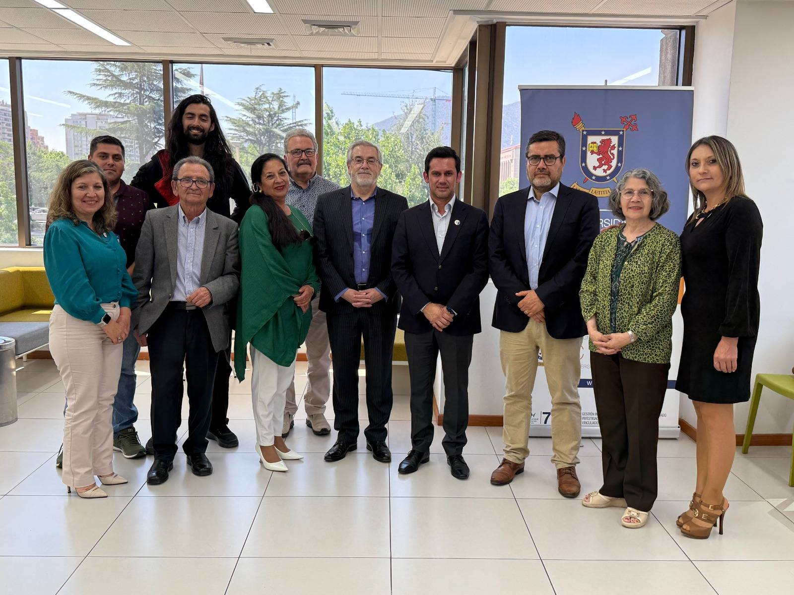

# Actividades

  <h2>Participación ciudadana y gestión local: análisis de los mecanismos institucionales en municipios chilenos el caso de Parral</h2>
  
<em> La Cátedra UNESCO dirigida por Bernardo Navarrete presenta los exitosos resultados de investigación sobre participación ciudadana en Parral: estudio resalta la confianza y el trabajo vinculante entre el COSOC y el municipio.</em>

  
  
Descripción breve de la actividad...

