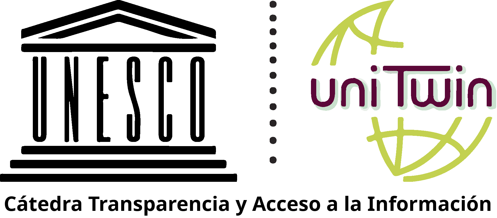

---
hide:
  - navigation
  - toc
---

#

  
  

    Promovemos la investigación, formación y difusión del conocimiento 
    sobre transparencia, gobierno abierto y derecho de acceso a la información pública.
  

  
  

    <a href="publicaciones/" style="text-decoration: none; color: inherit;">
      5
      Publicaciones
    </a>
  

  

    2
    Convenios
  

  

    <a href="quienes-somos/" style="text-decoration: none; color: inherit;">
      4
      Investigadores
    </a>
  

  

   <!--  <a href="quienes-somos/" style="text-decoration: none; color: inherit;">-->
      XXXX
      Workshops
      Seminarios
    </a>
  

  

   <!--  <a href="quienes-somos/" style="text-decoration: none; color: inherit;">-->
      XXXX
      Apariciones en prensa
    </a>
  

