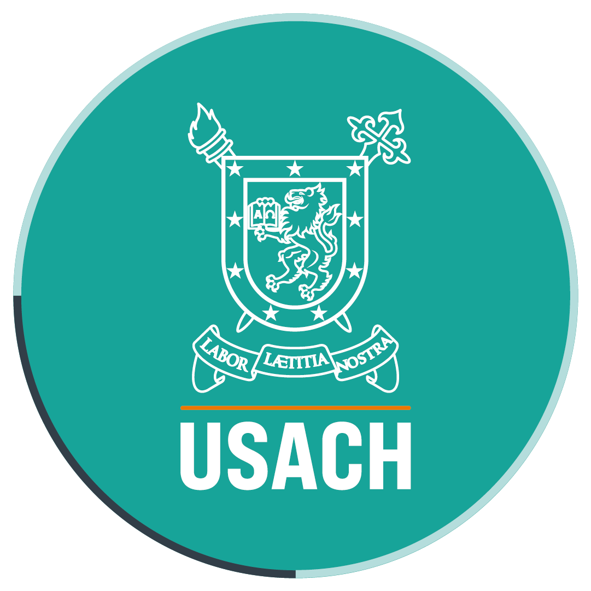

---
hide:
  - navigation
  - toc
---

#

  
  

    Promovemos la investigación, formación y difusión del conocimiento 
    sobre transparencia, gobierno abierto y derecho de acceso a la información pública.
  

  

    <a href="quienes-somos/" class="md-button md-button--primary">Conócenos</a>
    <a href="actividades/" class="md-button">Ver Actividades</a>
  

  
  

    <a href="investigacion/#publicaciones" style="text-decoration: none; color: inherit;">
      5
      Publicaciones
    </a>
  

  

    <a href="actividades/" style="text-decoration: none; color: inherit;">
      XX
      Actividades
    </a>
  

  

    2
    Convenios
  

  

    <a href="quienes-somos/" style="text-decoration: none; color: inherit;">
      4
      Investigadores
    </a>
  

  
Con el apoyo de:

  

    
    
  

