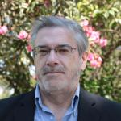
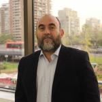
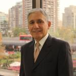
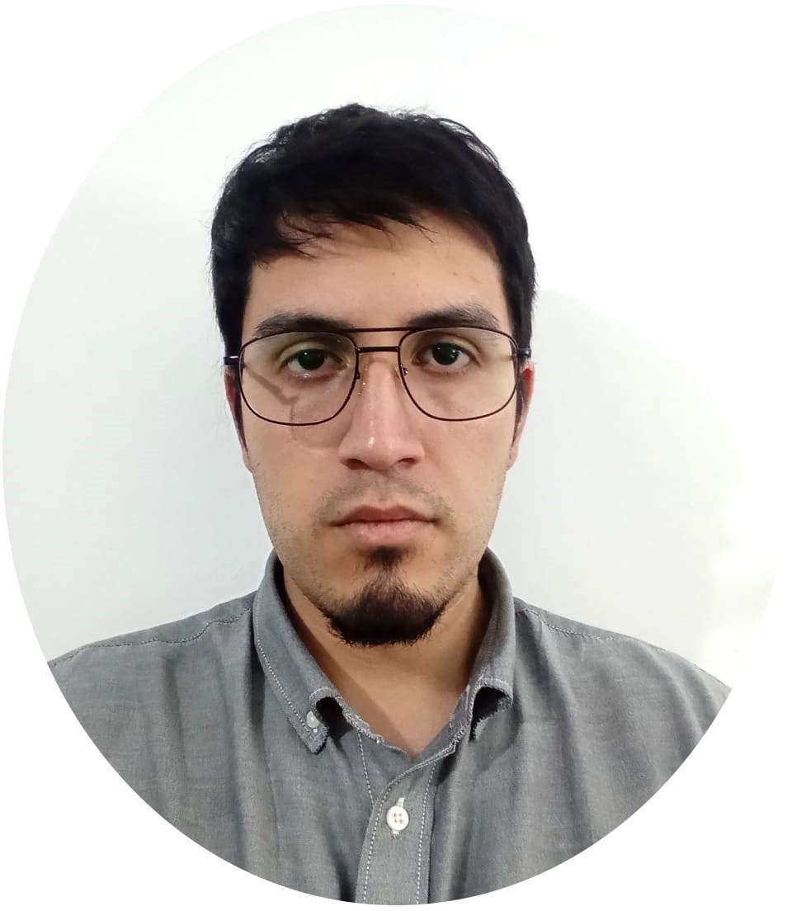

# Quienes somos

La Cátedra UNESCO de Transparencia y Acceso a la Información reúne a investigadores 
comprometidos con la promoción del conocimiento abierto y los derechos ciudadanos.

---

  
  

    <h3>Bernardo Navarrete</h3>
    
Director

    
<strong>Afiliación:</strong> Universidad de Santiago de Chile — Departamento de Estudios Políticos.

    
<strong>Líneas de investigación:</strong> Política y políticas públicas subnacionales (Política, Administración, Territorio –PAT-); Partidos y sistemas de partidos subnacionales; Transparencia e integridad.

    
<strong>Grado:</strong> Doctor en Gobierno y Administración Pública, Instituto Universitario Ortega y Gasset, España.
 
  

---

  
  

    <h3>Nelson Paulus</h3>
    
Investigador

    
<strong>Afiliación:</strong> Universidad de Santiago de Chile — Departamento de Estudios Políticos.

    
<strong>Líneas de investigación:</strong> Sociología Política; Sociología de la Educación; Sociología Analítica.

    
<strong>Grado:</strong> Doctor en Sociología, Universidad Autónoma de Barcelona, España.
 
  

---

  
  

    <h3>Afonso Dingemans</h3>
    
Investigador

    
<strong>Afiliación:</strong> Universidad de Santiago de Chile — Departamento de Estudios Políticos.

    
<strong>Líneas de investigación:</strong> Economía política internacional; Relaciones económicas internacionales (América Latina, Asia); Estudios Internacionales.

    
<strong>Grado:</strong> Doctor en Estudios Americanos, Instituto de Estudios Avanzados, Universidad De Santiago de Chile.
 
  

---

  
  

    <h3>Mauricio Olavarría-Gambi</h3>
    
Investigador

    
<strong>Afiliación:</strong> Universidad de Santiago de Chile — Departamento de Estudios Políticos.

    
<strong>Líneas de investigación:</strong> Políticas Públicas y Gobernanza; Pobreza y Desigualdad; Criminalidad.

    
<strong>Grado:</strong> Doctor en Policy Studies, University of Maryland at College Park.
 
  

---

  
  

    <h3>José San Martin</h3>
    
Asistente de investigación

    
<strong>Afiliación:</strong> Universidad de Santiago de Chile — Departamento de Economía.

    
<strong>Líneas de investigación:</strong> Ética; Transparencia e integridad; Conflicto y cohesión social.

    
<strong>Grado:</strong> (Tesista) Magíster en Ciencia de Datos Aplicados, Universidad de Santiago de Chile.
 
  

---